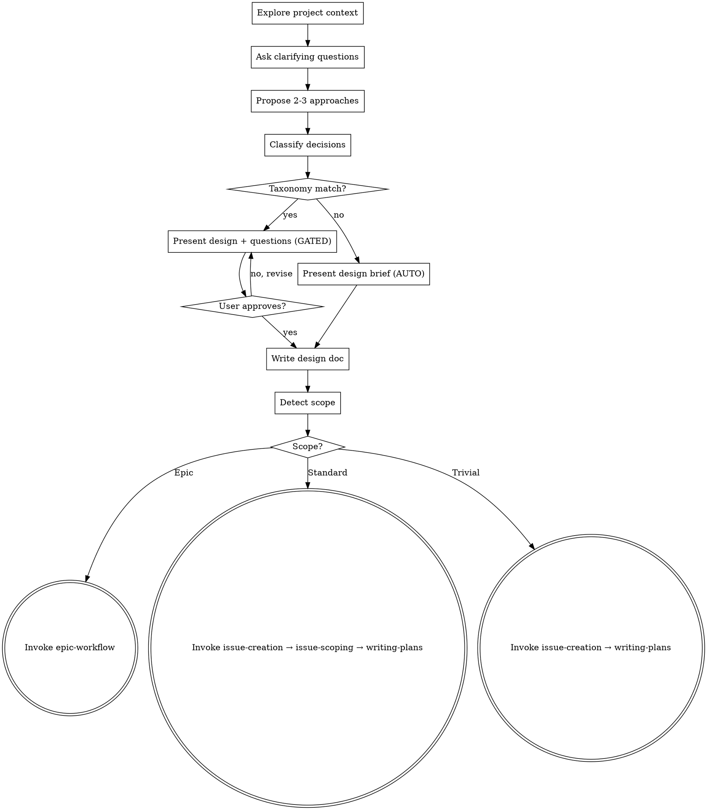

> ⛔ **This skill MUST be read in full — not skimmed.** Formal review gates depend on its workflow.
> Skipping steps silently bypasses quality checks. Missing gates = undetected breakages.

<!-- git-sync: fetch origin before reading project context -->
**Pre-flight:** Fetch latest from origin to ensure project context is current:

```bash
git fetch origin main --quiet 2>/dev/null || true
BEHIND=$(git rev-list --count $(git merge-base HEAD origin/main)..origin/main 2>/dev/null || echo 0)
if [ "$BEHIND" -gt 5 ]; then
  echo "⚠️ current checkout base is $BEHIND commits behind origin/main."
  echo "   Design decisions may be based on stale project state."
fi
```


> **Fork note:** Local override of `brainstorming` v4.3.1. Changes: (1) HARD-GATE only when taxonomy-matching decisions exist, (2) auto-proceed for non-taxonomy tasks, (3) structured question format for taxonomy decisions, (4) reframed anti-pattern, (5) scope-based routing. See `human-input-framework` for canonical taxonomy.

# Brainstorming Ideas Into Designs

> **Ontology:** `docs/teams/organisation-design-team/data/ONTOLOGY.md` — canonical entity classes, work vocabulary, domain taxonomy.

## Overview

Help turn ideas into fully formed designs and specs through natural collaborative dialogue.

Start by understanding the current project context, then ask questions one at a time to refine the idea. Once you understand what you're building, classify decisions against the taxonomy and either gate or proceed.

## Anti-Pattern: Skipping the Thinking

Every project goes through the thinking process — exploring context, asking questions, proposing approaches. A todo list, a single-function utility, a config change — all of them. "Simple" projects are where unexamined assumptions cause the most wasted work.

The anti-pattern is **skipping the thinking**, not skipping the human gate. Do the exploration and design work regardless. The gate behavior depends on whether decisions match the taxonomy.

## Human Input Taxonomy (inlined from human-input-framework v2.0.0)

### Research-Before-Ask Protocol (MANDATORY — runs BEFORE any pause)

When a taxonomy match occurs, do NOT pause immediately. Run this protocol first:

1. **Internal Research** — Search codebase for existing patterns, conventions, or prior decisions
2. **External Research** — Perplexity queries for best practices, how others solve this
3. **Decision:**
   - >80% confidence → Apply decision, note with ponytail comment. DO NOT PAUSE.
   - 50-80% confidence → Apply best-supported option, note rationale. DO NOT PAUSE.
   - <50% confidence → Pause with structured question + research findings.
   - P0 consequence (data loss, security, irreversible, cost >$10/mo, legal/compliance) → Pause regardless.

### Taxonomy Categories

Pause and present structured questions when a decision involves ANY of:

1. **Ontology changes** — new tables, columns, relationships, semantic meaning changes
2. **UX changes** — visible user-facing behavior/layout/flow changes not explicitly requested
3. **One-way doors** — destructive operations, data migrations, schema drops, force pushes
4. **Third-party dependencies** — new API integrations, service subscriptions
5. **Cost impact** — changes increasing recurring costs by >$1-3/month
6. **Scope expansion** — implementing beyond what was requested

**Tie-breaking rule:** When uncertain whether a decision matches the taxonomy, RESEARCH FIRST. Pause only if research is inconclusive OR P0 (data loss, security, irreversible, cost >$10/mo, legal/compliance).

Everything else → proceed with a brief note, open to iteration.

## Checklist

You MUST create a task for each of these items and complete them in order:

1. **Explore project context** — check files, docs, recent commits
2. **Ask clarifying questions** — one at a time, understand purpose/constraints/success criteria
3. **Propose 2-3 approaches** — with trade-offs and your recommendation
   **Component reuse check:** Before designing new UI elements, quickly scan `docs/teams/eldato-app-team/ux/component_catalog.md` — it documents 35 shadcn/ui primitives and 80+ custom components already in the codebase. Prefer existing over new; a duplicate component is waste.
4. **Classify decisions** — do any decisions match the taxonomy?
5. **Present design** — scaled to complexity (see Gating Rules below)
6. **Write design doc** — first run the Pre-flight: Worktree Check below, then save to `docs/plans/YYYY-MM-DD-<topic>-design.md` and commit
7. **Detect scope and route** — see ## Scope Detection & Routing for the full routing algorithm

## Pre-flight: Worktree Check

**⛔ MANDATORY — do not skip.** The `main-worktree-guard` Pi extension blocks `write`/`edit` operations in the main checkout. Create a worktree before proceeding.

Run before Step 6 (writing the design doc):

```bash
# Check worktree isolation — block unless in a worktree or opted out
TOPDIR=$(git rev-parse --show-toplevel 2>/dev/null) || exit 1
GIT_COMMON=$(git rev-parse --git-common-dir 2>/dev/null || echo ".git")
case "$GIT_COMMON" in
  .git) NORMALIZED="$TOPDIR/.git" ;;
  /*)   NORMALIZED="$GIT_COMMON" ;;
  *)    NORMALIZED="$TOPDIR/$GIT_COMMON" ;;
esac
if [ "$NORMALIZED" != "$TOPDIR/.git" ]; then
  echo "✅ Worktree detected: $(git rev-parse --show-toplevel) — proceeding."
elif [ "${AGENT_ALLOW_MAIN_EDITS:-}" = "1" ]; then
  echo "ℹ️ Main repo — AGENT_ALLOW_MAIN_EDITS=1 is set, proceeding with override."
else
  echo "⛔ BLOCKED: You are in the main repository checkout."
  echo "   → Create a worktree: invoke the using-git-worktrees skill."
  echo "   → Or set AGENT_ALLOW_MAIN_EDITS=1 to override (reviewer/read-only sessions)."
  exit 1
fi
```

If already inside a worktree, this is a no-op. If in the main repo, invoke `using-git-worktrees` to create an isolated worktree before continuing. Skip only if `AGENT_ALLOW_MAIN_EDITS=1` is set (read-only/reviewer sessions).

## Gating Rules

After step 4 (classify decisions):

### Path A: Taxonomy-matching decisions exist → GATED

Present the design with structured questions for each taxonomy-matching decision:

```
**Decision: [short title]**
- **Options:** [2-4 concrete choices]
- **Analysis:** [1-2 sentences on trade-offs]
- **Recommendation:** [which option and why]
```

Wait for user approval of the design and answers to structured questions before proceeding to step 6.

If user says "work on it" without answering → follow the "Work On It" protocol:
- First time: re-surface the specific questions
- Second time: pick your recommendations, note them clearly, proceed

### Path B: No taxonomy-matching decisions → AUTONOMOUS

Present a brief design summary (architecture, components, approach) as an informational note. Do NOT wait for explicit approval. Proceed directly to step 6 (write design doc) and step 7 (invoke writing-plans).

The user can always interrupt or iterate — the design is open to feedback. But there's no gate blocking progress.

## Process Flow



**The terminal state depends on scope:** Epic projects route to `epic-workflow`; Standard projects route to `issue-creation` → `issue-scoping` → `writing-plans`; Trivial projects route to `issue-creation` → `writing-plans`. Do NOT invoke any other implementation skill (frontend-design, mcp-builder, etc.).

## The Process

**Understanding the idea:**
- Check out the current project state first (files, docs, recent commits)
- Ask questions one at a time to refine the idea
- Prefer multiple choice questions when possible, but open-ended is fine too
- Only one question per message - if a topic needs more exploration, break it into multiple questions
- **Filter technical questions out.** Before asking the user a clarifying question, check: is this a "how does X work" or "what library/pattern handles Y" question? If so, research it via `mcp__context7__query_docs` or `web_search` instead of asking. Only ask the user when the question maps to UX, strategy, or ontology (taxonomy categories 1, 2, 6). See `## Research Discipline` in CLAUDE.md.
- Focus on understanding: purpose, constraints, success criteria

**Exploring approaches:**
- Propose 2-3 different approaches with trade-offs
- Present options conversationally with your recommendation and reasoning
- Lead with your recommended option and explain why

**Presenting the design:**
- Once you believe you understand what you're building, present the design
- Scale each section to its complexity: a few sentences if straightforward, up to 200-300 words if nuanced
- For GATED path: ask after each section whether it looks right so far
- For AUTONOMOUS path: present all sections together as a brief summary
- Cover: architecture, components, data flow, error handling, testing
- Be ready to go back and clarify if something doesn't make sense

## After the Design

**Documentation:**
- Write the validated design to `docs/plans/YYYY-MM-DD-<topic>-design.md`
- Commit the design document to git

**Implementation:**
- Run scope detection and route to the appropriate skill per ## Scope Detection & Routing

## Scope Detection & Routing

After the design doc is committed (step 6), classify the project scope and route to the appropriate downstream skill pipeline.

### Step 6.5 — Detect Scope

Extract these variables from the completed design:

| Variable | Definition |
|----------|-----------|
| `task_count` | Number of **checklist items** produced during brainstorming (the numbered list in the design). Not paragraphs, not DB operations. |
| `system_count` | Number of **distinct system boundaries** touched. Count: Supabase DB (migrations), Edge Functions, Frontend (components/pages), External APIs, Cron jobs, Cloudinary. A DB migration alone = 1 system unless accompanied by edge functions. |
| `file_count` | Number of files the design proposes to **create** (not modify). Add-to-existing = 0. |
| `migration_present` | Design proposes ≥ 1 Supabase migration (DDL in `supabase/migrations/`). |
| `directory_count` | Number of distinct parent directories of files to create. |

### Classification (first match wins)

| Tier | Rule |
|------|------|
| **Epic** | `task_count ≥ 9` **OR** `(system_count ≥ 2 AND migration_present)` |
| **Trivial** | `task_count = 1 AND file_count = 1 AND NOT migration_present` |
| **Standard** | Everything else |

System count, file count, and directory count are **confirming signals** displayed in the classification dialog but do not independently trigger Epic.

### Doubt-Only Protocol

**Auto-pick rule:** When signals conflict at a boundary, auto-pick the **higher** tier. Over-classifying costs time (more process); under-classifying costs structure (skipped gates, missing architecture). Both are recoverable — but over-classifying is the safer default.

| Boundary | Auto-pick | Why |
|----------|-----------|-----|
| Epic vs Standard (task_count=8-9, few systems) | **Epic** | Process overhead < missing architecture |
| Epic vs Standard (2+ systems + migration, few tasks) | **Epic** | Multi-system + migration = needs epic structure |
| Standard vs Trivial (1 task, 1 file, no migration) | **Trivial** | Clear-cut — fast-path is safe |
| Standard vs Trivial (1 task, 1 file, migration present) | **Standard** | Rule already handles — migration disqualifies Trivial |

**When to pause (rare):** Ask only when the boundary is genuinely ambiguous AND the user has previously expressed a strong preference about process overhead (e.g., they explicitly said "no epics for small projects" or "always use issue-scoping"). Otherwise, auto-pick the higher tier and note the choice in the dialog.

**Override protocol:** If user disagrees, present all three tiers as options. Routing always follows the confirmed/overridden classification. Follow existing "Work On It" protocol.

**Interaction with taxonomy gates:** The existing Path A/B taxonomy gates (steps 4–5) operate independently. Taxonomy gates control whether the user reviews design decisions; routing controls which skill pipeline the project enters. Both apply — a project can be taxonomy-gated (Path A) AND classified as Epic.

### Routing

| Scope | Step 6 behavior | Step 7 routing | Handoff |
|-------|----------------|----------------|---------|
| **Epic** | Write **lightweight handoff brief** (1–2 paragraphs — not a full `docs/plans/` design doc) | Route to `epic-workflow`. Brainstorming **exits**. | `epic-workflow` takes over with the handoff brief as context. |
| **Standard** | Write **full design doc** (existing step 6, unchanged) | Invoke `issue-creation` → when issue is created, invoke `issue-scoping` on it → when scoping plan is posted, invoke `writing-plans` | Brainstorming **chains through** all three. |
| **Trivial** | Write **inline 1-paragraph summary** (no separate design doc file) | Invoke `issue-creation` → invoke `writing-plans` (skip `issue-scoping`) | Brainstorming **chains through** both. |

**Skill invocation:** Use the existing pattern: "Invoke the [skill-name] skill."

### issue-workflow Context Exception

When brainstorming is invoked from `issue-workflow` Phase 2 (an issue number is in context and `issue-scoping` already completed in Phase 1):

- **Detection:** Check whether the session context includes an existing `gh issue view` result with an `<!-- issue-scoping:` signature comment.
- **Standard/Trivial paths:** Skip `issue-creation` and `issue-scoping` → route directly to `writing-plans`.
- **Epic path:** Still invoke `epic-workflow`. `issue-workflow` **terminates** with: *"This is epic-scope work. `epic-workflow` will produce child issues. Run each child through `issue-workflow` separately."*

## Key Principles

- **One question at a time** - Don't overwhelm with multiple questions
- **Multiple choice preferred** - Easier to answer than open-ended when possible
- **YAGNI ruthlessly** - Remove unnecessary features from all designs
- **Explore alternatives** - Always propose 2-3 approaches before settling
- **Always think** - Exploration and design thinking happen for every task, regardless of gating
- **Gate on substance** - Only block on decisions that match the taxonomy
- **Be flexible** - Go back and clarify when something doesn't make sense
---
> Continue following the workflow as mandated by this skill. Do not skip steps.
