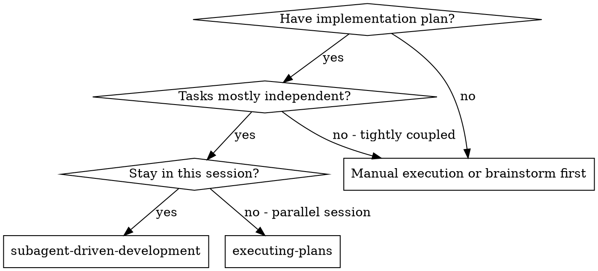
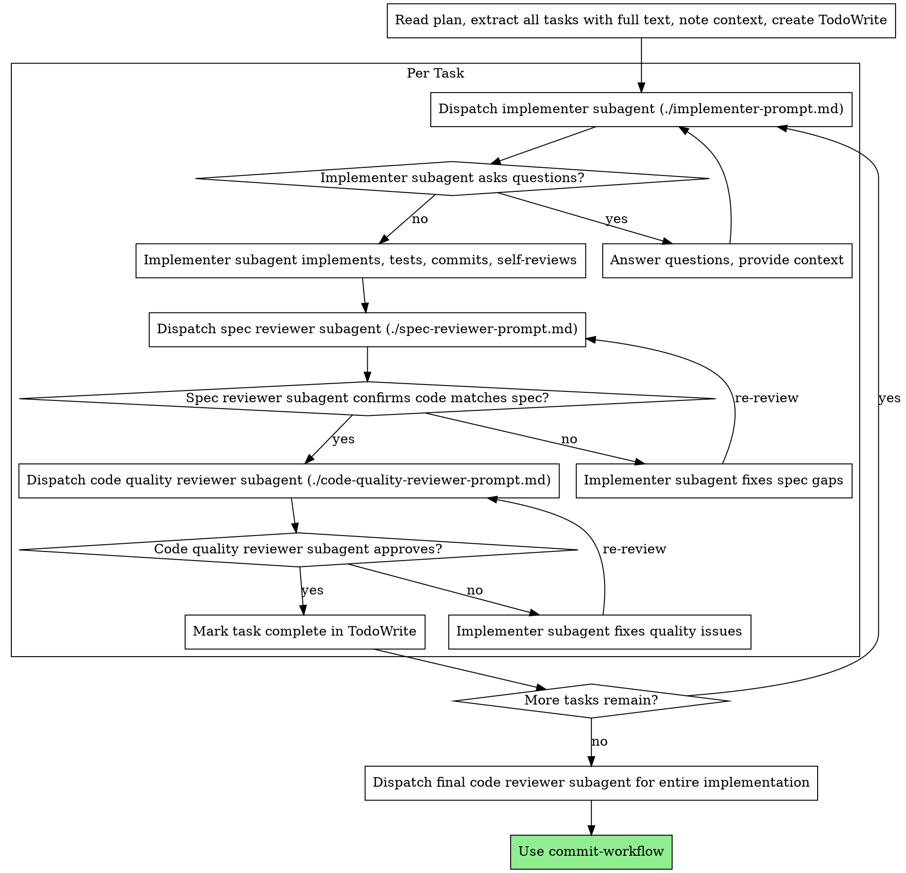

> ⛔ **This skill MUST be read in full — not skimmed.** Formal review gates depend on its workflow.
> Skipping steps silently bypasses quality checks. Missing gates = undetected breakages.

<!-- Changes: WebSearch→web_search, WebFetch→web_fetch, TodoWrite→todo_write, Task→task, AskUserQuestion→ask directly, context7 unavailable, Supabase MCP→migration-safe/supabase CLI -->


> **Source:** Canonical copy at `skills/subagent-driven-development/SKILL.md`.

# Subagent-Driven Development
Execute plan by dispatching fresh subagent per task, with two-stage review after each: spec compliance review first, then code quality review.

**Why subagents:** You delegate tasks to specialized agents with isolated context. By precisely crafting their instructions and context, you ensure they stay focused and succeed at their task. They should never inherit your session's context or history — you construct exactly what they need. This also preserves your own context for coordination work.

**Core principle:** Fresh subagent per task + two-stage review (spec then quality) = high quality, fast iteration

## Worktree Ownership Rule (anti-nesting)

**The controller — not the subagent — owns worktree creation.** Subagents must never invoke `using-git-worktrees` or call `git worktree add` on their own. When a subagent dispatched from inside a worktree tries to create its own worktree, the new worktree nests inside the current one (`.worktrees/agent-A/.worktrees/agent-B`), which breaks teardown, leaks commits, and can cascade to 3+ levels.

**Controller responsibilities (this skill, running in the main conversation):**
1. Invoke `using-git-worktrees` ONCE, before dispatching any implementer subagent.
2. After the worktree is created, capture its absolute path.
3. Include the worktree path in every implementer subagent's prompt: `Your working directory is <absolute-path>. cd there first. Do NOT create a worktree — one already exists.`

**Subagent responsibilities (implementers, reviewers):**
- `cd` into the provided worktree path as their first action.
- Treat that directory as their workspace for the entire task.
- Never invoke `using-git-worktrees`.
- Never call `git worktree add`.

This rule applies recursively: if an implementer subagent itself dispatches further subagents (rare but allowed), it must forward the same worktree path, not create a new one.


## Never-Unbounded-Launch Rule

> **Never launch an unbounded nested pi.** Every nested or background `pi`
> launch MUST carry a hard timeout (30 minutes — the bounded-launch template
> below), a log redirect (`> /tmp/<launch-unique>.log 2>&1` — unique per
> launch; the template names it via `mktemp`), and a liveness
> marker — a `[task-heartbeat]` line written to the log at regular intervals
> (markers require `TASK_HEARTBEAT=1` AND `PI_MODE=print` set explicitly on
> the launch — the runtime writes them only when both are present; the task
> tool injects both, a manual nested launch must set them itself).
> Abort semantics: no marker within the window → the process is dead or
> blocked at the OS level → ABORT; markers present but no completion → the
> timeout is the bound — do NOT extend it. Note: marker presence ≠ progress —
> a gate-stalled pi keeps writing markers, which is exactly why the hard
> deadline is non-negotiable. On abort: kill the launch, surface the failure
> to the user, and never wait indefinitely — a silent wait is the failure
> mode this rule eliminates. The ONLY sanctioned guard escape is the terminal
> one-liner in `using-git-worktrees` (Guard Escape section), executed by the
> user in their own terminal — never by an agent tool, which the
> main-worktree guard blocks. When a bounded form is impossible, do not
> launch — escalate to the user instead.

### Bounded nested pi launch (the ONLY sanctioned form)

```bash
# Bounded nested pi launch — the ONLY sanctioned form of nested pi:
LOG="$(mktemp /tmp/nested-pi.XXXXXX)"
PI_MODE=print TASK_HEARTBEAT=1 pi -p "<prompt>" > "$LOG" 2>&1 &
launch_pid=$!
echo "launched $launch_pid → $LOG"

# Deadline watchdog — portable sleep-deadline + kill -0 liveness probe
# (no GNU timeout on macOS): SIGTERM at 1800s; SIGKILL after a 60s grace.
( sleep 1800; if kill -0 "$launch_pid" 2>/dev/null; then kill "$launch_pid"; pkill -P "$launch_pid" 2>/dev/null; sleep 60; kill -9 "$launch_pid" 2>/dev/null; fi ) &

# Liveness check + abort trigger — [task-heartbeat] markers land on stderr
# every 30s (2>&1 merged). No marker within 60s → the process is dead or
# blocked at the OS level → ABORT. Markers present → the launch is ALIVE and
# the 30-min deadline watchdog is the only remaining bound — do NOT kill here:
sleep 60
if grep -q '\[task-heartbeat\]' "$LOG"; then
  echo "ALIVE — bounded by the 30-min deadline watchdog"
else
  echo "NO MARKER — ABORTING (process dead/blocked at OS level)"
  kill "$launch_pid" 2>/dev/null
  pkill -P "$launch_pid" 2>/dev/null
  echo "ABORTED — surfacing to user"
  exit 1
fi
```

## When to Use



**vs. Executing Plans (parallel session):**
- Same session (no context switch)
- Fresh subagent per task (no context pollution)
- Two-stage review after each task: spec compliance first, then code quality
- Faster iteration (no human-in-loop between tasks)

## The Process



## Model Selection

**Implementer + per-task reviewers (spec + code quality):** Use the same model as the current session. The session model is already configured with valid credentials and is capable of every task in this workflow. Do NOT specify a different model for sub-agents unless the user explicitly instructs you to do so.

**Final code reviewer (after all tasks):** Dispatch with `model="qwen3.8-max"`. This is the two-tier review pattern — Flash handles per-task reviews, Qwen3.8-Max serves as the senior gatekeeper for the final pass across the entire implementation. Qwen catches what cheaper per-task reviewers miss.

```
# Per-task reviews — session model (Flash)
task(prompt=spec_reviewer_prompt)
task(prompt=code_quality_reviewer_prompt)

# Final review — Qwen gate
task(prompt=final_code_reviewer_prompt, model="qwen3.8-max")
```

If the sub-agent dispatch mechanism accepts a `model` parameter, omit it for per-task reviews to use the session default. Pass `model="qwen3.8-max"` only for the final code reviewer.

## Handling Implementer Status

Implementer subagents report one of four statuses. Handle each appropriately:

**DONE:** Proceed to spec compliance review.

**DONE_WITH_CONCERNS:** The implementer completed the work but flagged doubts. Read the concerns before proceeding. If the concerns are about correctness or scope, address them before review. If they're observations (e.g., "this file is getting large"), note them and proceed to review.

**NEEDS_CONTEXT:** The implementer needs information that wasn't provided. Provide the missing context and re-dispatch.

**BLOCKED:** The implementer cannot complete the task. Assess the blocker:
1. If it's a context problem, provide more context and re-dispatch
2. If the task requires more reasoning, provide more detailed instructions and re-dispatch
3. If the task is too large, break it into smaller pieces
4. If the plan itself is wrong, escalate to the human

**Never** ignore an escalation or force the same model to retry without changes. If the implementer said it's stuck, something needs to change.

## Prompt Templates

- `./implementer-prompt.md` - Dispatch implementer subagent
- `./spec-reviewer-prompt.md` - Dispatch spec compliance reviewer subagent
- `./code-quality-reviewer-prompt.md` - Dispatch code quality reviewer subagent

## Example Workflow

```
You: I'm using Subagent-Driven Development to execute this plan.

[Read plan file once: docs/superpowers/plans/feature-plan.md]
[Extract all 5 tasks with full text and context]
[Create TodoWrite with all tasks]

Task 1: Hook installation script

[Get Task 1 text and context (already extracted)]
[Dispatch implementation subagent with full task text + context]

Implementer: "Before I begin - should the hook be installed at user or system level?"

You: "User level (~/.config/superpowers/hooks/)"

Implementer: "Got it. Implementing now..."
[Later] Implementer:
  - Implemented install-hook command
  - Added tests, 5/5 passing
  - Self-review: Found I missed --force flag, added it
  - Committed

[Dispatch spec compliance reviewer]
Spec reviewer: ✅ Spec compliant - all requirements met, nothing extra

[Get git SHAs, dispatch code quality reviewer]
Code reviewer: Strengths: Good test coverage, clean. Issues: None. Approved.

[Mark Task 1 complete]

...

[After all tasks]
[Dispatch final code-reviewer]
Final reviewer: All requirements met, ready to merge

[Use commit-workflow to land the work]
```

## Advantages

**vs. Manual execution:**
- Subagents follow TDD naturally
- Fresh context per task (no confusion)
- Parallel-safe (subagents don't interfere)
- Subagent can ask questions (before AND during work)

**vs. Executing Plans:**
- Same session (no handoff)
- Continuous progress (no waiting)
- Review checkpoints automatic

**Efficiency gains:**
- No file reading overhead (controller provides full text)
- Controller curates exactly what context is needed
- Subagent gets complete information upfront
- Questions surfaced before work begins (not after)

**Quality gates:**
- Self-review catches issues before handoff
- Two-stage review: spec compliance, then code quality
- Review loops ensure fixes actually work
- Spec compliance prevents over/under-building
- Code quality ensures implementation is well-built

**Cost:**
- More subagent invocations (implementer + 2 reviewers per task)
- Controller does more prep work (extracting all tasks upfront)
- Review loops add iterations
- But catches issues early (cheaper than debugging later)

## Red Flags

**Never:**
- Launch an unbounded nested `pi` — every nested/background pi launch carries the bounded template (TASK_HEARTBEAT=1 + PI_MODE=print, `mktemp` log, `sleep 1800` + `kill -0` watchdog, abort on no-marker) per the `## Never-Unbounded-Launch Rule` section.
- Start implementation on main/master branch without explicit user consent
- Skip reviews (spec compliance OR code quality)
- Proceed with unfixed issues
- Dispatch multiple implementation subagents in parallel (conflicts)
- Make subagent read plan file (provide full text instead)
- Skip scene-setting context (subagent needs to understand where task fits)
- Ignore subagent questions (answer before letting them proceed)
- Accept "close enough" on spec compliance (spec reviewer found issues = not done)
- Skip review loops (reviewer found issues = implementer fixes = review again)
- Let implementer self-review replace actual review (both are needed)
- **Start code quality review before spec compliance is ✅** (wrong order)
- Move to next task while either review has open issues
- **Let a subagent create its own worktree** — the controller creates the worktree once and passes the path into every subagent prompt. See "Worktree Ownership Rule" above.
- Dispatch a subagent without the "Do NOT create a worktree — one already exists at <path>" clause when already running inside a worktree

**If subagent asks questions:**
- Answer clearly and completely
- Provide additional context if needed
- Don't rush them into implementation

**If reviewer finds issues:**
- Implementer (same subagent) fixes them
- Reviewer reviews again
- Repeat until approved
- Don't skip the re-review

**If subagent fails task:**
- Dispatch fix subagent with specific instructions
- Don't try to fix manually (context pollution)

## Integration

**Required workflow skills:**
- **using-git-worktrees** — REQUIRED: the **controller** invokes this once before dispatching any subagent, then passes the worktree path into every subagent prompt. Subagents must NOT invoke `using-git-worktrees` themselves — doing so nests worktrees inside the current worktree. See "Worktree Ownership Rule" above.
- **writing-plans** — Creates the plan this skill executes
- **Code review feedback** — Process reviewer feedback directly (no separate skill needed)
- **commit-workflow** — Complete development after all tasks

**Subagents should use:**
- **test-driven-development** — Subagents follow TDD for each task

**Alternative workflow:**
- **executing-plans** — Use for parallel session instead of same-session execution
---
> Continue following the workflow as mandated by this skill. Do not skip steps.
